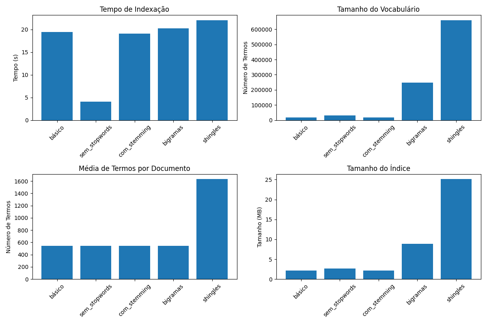

# Projeto de Extração e Análise de Dados IPEA

## 1. O que é este repositório

Este repositório contém uma solução completa para extração, processamento e armazenamento de dados econômicos do portal IPEADATA. O sistema automatiza a coleta de indicadores e documentos através de web scraping, converte PDFs em formato HTML para facilitar a análise e armazena os resultados de forma estruturada. A solução é implementada como um serviço programado que pode ser executado localmente para testes ou implantado na AWS para operação contínua.

O projeto inclui:
- Um extrator baseado em Selenium para navegar e coletar dados do site IPEADATA
- Um conversor de PDF para HTML para processamento de documentos
- Infraestrutura como código (IaC) usando Terraform para provisionamento na AWS
- Pipeline de CI/CD com GitHub Actions para desenvolvimento contínuo
- Sistema de representação e indexação de dados para busca e recuperação de informações

## 2. Dependências mínimas

### Para execução local
- Docker e Docker Compose
- Python 3.10+
- Bibliotecas Python: selenium, requests, beautifulsoup4, boto3, nltk, etc. (ver requirements.txt)

### Para implantação na AWS
- Conta AWS com direitos de administrador
- AWS CLI configurado
- Terraform 1.8.3+
- Docker instalado (para build local de imagens)

## 3. Organização de arquivos

```
/
├── .github/                # Configurações e workflows do GitHub Actions
│   ├── workflows/          # Workflows de CI/CD
│   └── deploy/             # Scripts de implantação
│
├── infra/                  # Código Terraform para infraestrutura AWS
│   ├── modules/            # Módulos Terraform
│   │   ├── ecr/            # Elastic Container Registry
│   │   ├── ecs/            # Elastic Container Service
│   │   │   ├── s3/         # Buckets S3
│   │   └── vpc/            # Configuração de rede
│   └── envs/               # Variáveis por ambiente (dev, stg, prod)
│
├── init/                   # Infraestrutura inicial para CI/CD e backend
│
├── src/                    # Código-fonte da aplicação Python
│   ├── config/             # Configurações da aplicação
│   ├── service/            # Componentes de serviço
│   │   ├── extract.py      # Lógica de extração de dados
│   │   ├── convert.py      # Conversão de PDF para HTML
│   │   ├── transform.py    # Transformação e mapeamento de documentos
│   │   └── index.py        # Indexação e busca de documentos
│   ├── entrypoint.sh       # Script de entrada para execução em container
│   ├── main.py             # Ponto de entrada da aplicação
│   ├── Dockerfile          # Definição da imagem Docker
│   ├── Dockerfile-index    # Definição da imagem Docker para indexação
│   ├── docker-compose.yml  # Configuração para extração de dados
│   ├── docker-compose-aws.yml # Configuração para extração com AWS
│   ├── docker-compose-index.yml # Configuração para indexação
│   └── requirements.txt    # Dependências Python
│
├── Makefile                # Comandos para facilitar operações
└── pyproject.toml          # Configuração do Poetry e dependências
```

## 4. Como executar localmente

### Execução com Docker (recomendado)

1. Navegue até a pasta src:
```bash
cd src
```

2. Execute sem integração com AWS:
```bash
docker-compose up # para iniciar o processo
# docker-compose up -d (caso nao queira acompanhar o processo)
docker-compose down # para finalizar o processo
```

3. Ou para executar com integração com AWS:
```bash
# Configure suas credenciais AWS
aws configure

# Execute usando o Docker Compose com configuração AWS
docker-compose -f docker-compose-aws.yml up
```

Após a execução, os dados extraídos estarão disponíveis:
- Localmente no diretório 'ipea' (se executado sem S3)
- No bucket S3 configurado (se executado com integração AWS)

## 5. Sistema de Representação/Indexação

O projeto implementa um sistema avançado de representação e indexação de documentos que permite busca eficiente nos dados extraídos do IPEA. A abordagem utiliza processamento de linguagem natural e índices invertidos para otimizar a recuperação de informações.



### 5.1 Características do Sistema de Indexação

- **Processamento Textual**: Normalização, tokenização, remoção de stopwords e stemming para português.
- **Índice Invertido**: Estrutura de dados otimizada para buscas por termo.
- **Múltiplas Configurações**: Suporte para diferentes modos de indexação (básico, sem stopwords, com stemming, bigramas, shingles).
- **Ranking TF-IDF**: Modelo de relevância baseado em Term Frequency-Inverse Document Frequency.
- **Análise Comparativa**: Métricas para avaliar desempenho das diferentes configurações (tempo, espaço, qualidade).

### 5.2 Como usar o sistema de indexação

#### 5.2.1 Execução via Docker (recomendado)

Para executar o sistema de indexação usando Docker, temos duas opções:

**Opção 1: Usando Docker Compose:**

```bash
# Construir e iniciar o container
docker-compose -f docker-compose-index.yml up --build

# Ou executar em segundo plano (modo detached)
docker-compose -f docker-compose-index.yml up --build -d
```

**Opção 2: Para entrar no container e executar scripts interativamente:**

```bash
# Iniciar o container em modo detached
docker-compose -f docker-compose-index.yml up --build -d

# Verificar o nome do container em execução
docker ps

# Acessar o container (substitua "nome_do_container" pelo nome real)
docker exec -it nome_do_container /bin/bash

# Dentro do container, executar o script de indexação
python index.py

# Para sair do container
exit
```

**Opção 3: Iniciar diretamente com shell interativo:**

```bash
# Iniciar o container com um shell interativo
docker-compose -f docker-compose-index.yml run --rm ipea-indexacao /bin/bash

# Dentro do container, executar o script
python index.py
```

**Opção 4: Usando Docker diretamente:**

```bash
# Construir a imagem
docker build -t ipea-indexacao -f Dockerfile-index .

# Executar o container
docker run --rm -v $(pwd):/app ipea-indexacao python index.py
```

## 6. Próximos Passos

O projeto está em desenvolvimento contínuo com os seguintes itens planejados:

- Otimização do algoritmo de ranking para melhorar a relevância dos resultados
- Implementação de compressão de índice para reduzir requisitos de armazenamento
- Desenvolvimento de interface web para buscas interativas
- Expansão de consulta com sinônimos e termos relacionados
- Tratamento dos documentos pdf extraidos dos links de cada html para buscas diretas

## 7. Contribuição

Contribuições são bem-vindas! Por favor, abra uma issue para discutir mudanças significativas antes de submeter um pull request.

## 8. Licença

Este projeto está licenciado sob os termos da licença MIT.