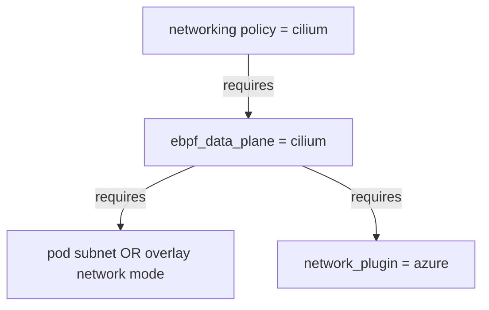
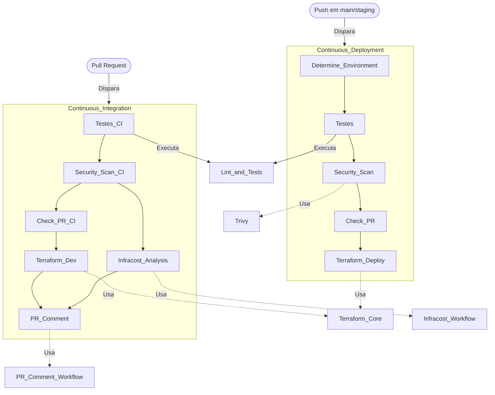

# Documentação CI/CD com Mermaid e Sphinx

## Introdução
Este documento descreve o processo completo de CI/CD implementado usando GitHub Actions, Terraform, Python, segurança e análise de custos.

## Visão Geral (Mermaid)

## Explicação dos Workflows

### Continuous Deployment

Este workflow é acionado por push nas branches `main` ou `staging` ou manualmente (`workflow_dispatch`). As etapas incluem:
- Determinação do ambiente de implantação (stg ou prod)
- Testes unitários e lint do código Python
- Scan de segurança com Trivy
- Checagem de PR aberta
- Deploy com Terraform no ambiente determinado

### Continuous Integration

Este workflow é acionado em pushes em outras branches e abertura de Pull Requests. As etapas incluem:
- Testes unitários e lint do código Python
- Scan de segurança com Trivy
- Checagem de PR aberta
- Análise de custos de infraestrutura com Infracost
- Deploy com Terraform no ambiente dev
- Comentário automático na PR com resultados do CI

## Workflows Compartilhados e Ferramentas

- **Security Scan**: Usa Trivy para scan de vulnerabilidades no sistema de arquivos.
- **Terraform Core**: Realiza validação, planejamento, e aplicação/destroy de recursos Terraform.
- **Infracost Analysis**: Avalia custos associados aos recursos Terraform.
- **PR Comment Workflow**: Posta comentários automatizados nas PRs com detalhes do processo de CI/CD.

## Dependências
Dependabot é utilizado para atualização semanal de:
- Dependências Python (pip)
- Ações do GitHub
- Imagens Docker